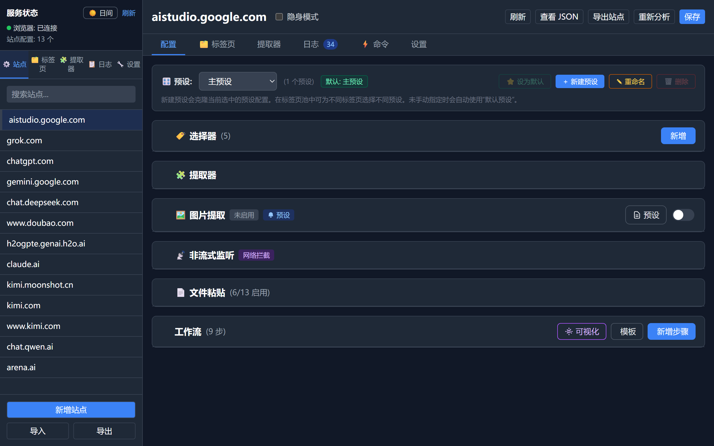
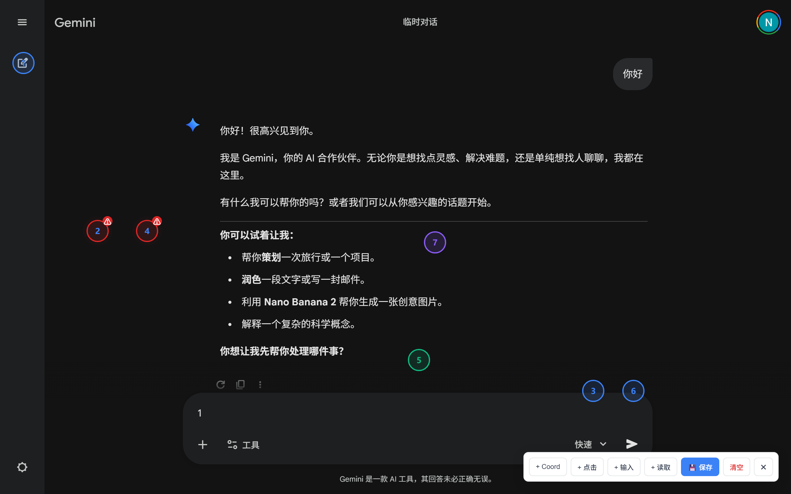

# Universal Web API

📖 Documentation • [English](./README.md) • [简体中文](./README.zh-CN.md)

> Document version: `v2.7.5`
>
> Turn any AI website you already use, such as ChatGPT, DeepSeek, Claude, or Gemini, into a standard OpenAI-compatible API for free, with full local deployment.

## Table of Contents

1. [Overview](#overview)
2. [Quick Start](#quick-start)
3. [Dashboard Tour](#dashboard-tour)
4. [Adding a New Site](#adding-a-new-site)
5. [Connecting to the API](#connecting-to-the-api)
6. [Tab Pool and Presets](#tab-pool-and-presets)
7. [Key Configuration](#key-configuration)
8. [Advanced Configuration](#advanced-configuration)
9. [Important Notes](#important-notes)
10. [FAQ](#faq)
11. [Project Structure](#project-structure)
12. [Dependencies and Roadmap](#dependencies-and-roadmap)
13. [Disclaimer](#disclaimer)

---

## Overview

This project is built on **DrissionPage** browser automation. It works like a local robot operator: it opens a real browser on your machine, interacts with AI websites like a human user, and returns the result through a standard API endpoint.

### Why use it

- Free usage: reuse the website quota or account access you already have
- Local and private: your login stays on your own machine and cookies do not need to be uploaded
- AI-assisted adaptation: unsupported sites can be analyzed automatically
- Multi-tab scheduling: handle requests with multiple browser tabs in parallel
- Preset system: keep separate configs for chat, vision, coding, and more on the same site

### Supported sites

| Site | URL | Notes |
|------|-----|-------|
| ChatGPT | `chatgpt.com` | About 200k max single-send length |
| DeepSeek | `chat.deepseek.com` | Reply-reading issues in thinking mode |
| Gemini | `gemini.google.com` | About 30k on free accounts; no clear limit observed on Pro |
| Claude | `claude.ai` | Site-specific parsing supported |
| Kimi | `www.kimi.com` | Synced with the current built-in config |
| Qwen | `chat.qwen.ai` | Qwen page adaptation supported |
| Grok | `grok.com` | Supported |
| Doubao | `www.doubao.com` | New domain already adapted |
| AI Studio | `aistudio.google.com` | Supported |
| Arena AI | `arena.ai` | Sensitive to IP quality |

Sites outside this list can still be adapted through AI-based page analysis or manual configuration.

## Community

If you need help, you can join the QQ group: **1073037753**.

---

## Quick Start

### 1. Download and install

1. Download the release package.
2. Extract it into a folder **without Chinese characters in the path**, for example `D:\AI_Tools\Universal-Web-API`.
3. Make sure at least one Chromium-based browser is installed:
   - Google Chrome
   - Microsoft Edge
   - Brave / Vivaldi / Opera

### 2. Start the service

1. Double-click **`start.bat`** in the project folder.
2. The script will:
   - check the environment
   - install required dependencies
   - apply the DrissionPage patch used for stealth-mode optimization
3. When the terminal stops scrolling, you should see something like:

```text
Web UI started, please visit: http://127.0.0.1:8199
```

4. Open the dashboard by:
   - holding `Ctrl` and clicking the link in the terminal
   - or manually opening `http://127.0.0.1:8199`

### 3. Log in

After startup, the program opens a browser window automatically.

1. Open the AI website you want to use in that controlled browser.
2. Log in manually.
   - Recommended: the API will inherit your account permissions, such as membership benefits or history.
   - Optional: if the site works without login, you can use it directly.
3. Do not close the controlled browser. Return to the Web UI on port `8199` and continue configuration there.

The tutorial page no longer opens automatically inside the controlled browser. Keeping the docs open elsewhere is fine. What you should avoid is opening unrelated tabs inside the browser controlled by the script.

### 4. What to check first

When you enter the dashboard for the first time, check these areas in order:

1. Service status in the top-left corner
2. Site list in the sidebar
3. Site config page for selectors, workflow, and stream settings
4. Tab pool to confirm the current page was recognized
5. Logs page if your first test fails



---

## Dashboard Tour

The dashboard is the visual control center of the project, not just a settings page.

### Sidebar

- Shows browser connection status, auth status, and site count
- Supports search, add, import, and export
- Lets you switch between Sites, Tabs, Extractors, Logs, and Settings

### Site Configuration

This is where you define how a site should be operated:

- **Selectors**: where to type, click, and read replies
- **Workflow**: what actions to perform and in what order
- **Image extraction**: how generated images are collected
- **Response detection**: how the system decides the answer is finished
- **File attach**: how oversized prompts are uploaded as files
- **Presets**: multiple configuration sets for the same site

### Tab Pool

- View each tab's index, state, and current URL
- Copy the dedicated API endpoint of a specific tab
- Assign different presets to different tabs
- Quickly locate busy or broken tabs

### Extractors

Useful when the page clearly has a reply but the API output is wrong:

- view available extractors
- set the global default extractor
- bind a site-specific extractor
- mark whether a binding is only configured or already verified

### Logs and Settings

Logs help you check whether the problem happened before sending, during sending, while waiting, during extraction, or inside automation commands.

Settings are used for:

- environment values such as host, port, auth, proxy, and helper AI settings
- browser constants such as element timeout and stream thresholds
- AI element recognition
- update whitelist

---

## Adding a New Site

There are two main ways to add a site: **automatic recognition** and **manual configuration**.

### Path A: automatic recognition

Use this when the page structure is fairly standard or you want a quick first draft.

**Prerequisites**

1. Fill in `HELPER_API_KEY`, `HELPER_BASE_URL`, and `HELPER_MODEL` in `Settings -> Environment`.
2. Open the target site in the controlled browser.
3. Stay on the real chat page, not the landing page or login page.

**How it works**

If a domain is **not in `config/sites.json`**, the first real API request to that domain will:

1. read the current page HTML
2. ask the helper AI to analyze the page
3. generate `selectors + workflow + default preset`
4. save the result to `config/sites.json`

This means automatic recognition is triggered by the **first real request to an unknown domain**, not by the Add Site button.

### Path B: manual configuration

Use this when:

- you do not want to spend helper-AI tokens
- the page structure is unusual
- you want full control over selectors and workflow

**Recommended steps**

1. Click **Add Site**
2. Enter the domain, for example `chat.example.com`
3. Open the site's main preset
4. Fill in the minimum required selectors
5. Build the shortest working workflow
6. Test selectors one by one
7. Save and make one real API request

### Minimum working setup

Start with these selectors:

| Key | Purpose |
|-----|---------|
| `input_box` | Chat input field |
| `send_btn` | Send button |
| `result_container` | AI reply container |

Start with a short workflow:

```json
[
  { "action": "CLICK", "target": "new_chat_btn", "optional": true, "value": null },
  { "action": "WAIT", "target": "", "optional": false, "value": 0.5 },
  { "action": "FILL_INPUT", "target": "input_box", "optional": false, "value": null },
  { "action": "CLICK", "target": "send_btn", "optional": true, "value": null },
  { "action": "KEY_PRESS", "target": "Enter", "optional": true, "value": null },
  { "action": "STREAM_WAIT", "target": "result_container", "optional": false, "value": null }
]
```

Debug in this order:

1. `input_box`
2. `send_btn`
3. `result_container`
4. full workflow
5. stream thresholds, extractors, image extraction, and file attach

### Practical advice

- Do not add too many workflow steps at the beginning.
- Do not change global browser constants before the site itself works.
- Always manually review the result after auto recognition, especially `result_container`.
- If the website already replied but the API did not finish, inspect stream settings before blaming selectors.

---

## Connecting to the API

The project exposes an **OpenAI-compatible** API, so it can be used by most clients that support OpenAI-style endpoints.

### Common client settings

| Field | Value |
|-------|-------|
| Provider | `OpenAI`, `OpenAI Compatible`, or `Custom` |
| Base URL | `http://127.0.0.1:8199/v1` |
| API key | Any value is fine, for example `sk-any` |
| Model name | Any value is fine; the actual model depends on the website tab |

### Routes

| Route | Format | Description |
|-------|--------|-------------|
| Default route | `/v1/chat/completions` | Automatically uses one idle tab |
| Fixed tab | `/tab/{index}/v1/chat/completions` | Uses a specific tab index from the tab pool |

Some clients need the full path:

`http://127.0.0.1:8199/v1/chat/completions`

### Example

```bash
curl http://127.0.0.1:8199/v1/chat/completions \
  -H "Content-Type: application/json" \
  -H "Authorization: Bearer sk-any" \
  -d '{
    "model": "any",
    "messages": [{"role": "user", "content": "Hello"}],
    "stream": true
  }'
```

### SillyTavern note

SillyTavern's built-in API test can be unreliable. It is better to test by sending a real conversation instead of pressing the test button.

### Function calling compatibility

Since `v2.5.8`, the project documents compatibility with standard OpenAI tool-calling fields:

- `tools` / `tool_choice`
- legacy `functions` / `function_call`

This is still not true native tool calling from the target website. The backend converts tool definitions and constraints into prompts that the web model can understand, then parses the structured response back into `tool_calls`.

In practice:

- stronger models work much better
- weaker models may break JSON, miss arguments, or mix normal text into tool output
- fewer tools and simpler schemas usually improve success rate

---

## Tab Pool and Presets

### Tab Pool

The tab pool is the main scheduling mechanism. The script scans supported AI-site tabs in the browser and assigns each recognized tab a **persistent index**.

How it works:

1. You open one or more AI-site tabs
2. The script detects them and assigns indices such as `1`, `2`, and `3`
3. Incoming API requests are routed to an idle tab
4. After the request completes, the tab returns to the pool

You can use the dashboard to:

- view tab state in real time
- inspect current URL and request count
- copy a dedicated endpoint
- assign presets per tab

Blank pages such as `chrome://newtab` are not added to the pool.

### Presets

Presets let you create **multiple independent configurations for the same site** and assign them to different tabs.

Typical use cases:

| Tab | Preset | Difference |
|-----|--------|------------|
| Tab #1 | Pro chat | Longer timeout, deep extractor |
| Tab #2 | Fast vision | Simpler workflow, image extraction enabled |
| Tab #3 | Coding assistant | File attach enabled, higher thresholds |

Workflow:

1. Create a preset in `Site -> Config -> + New Preset`
2. Assign that preset in the `Tabs` page
3. Call the tab with `/tab/{index}/v1/chat/completions`

---

## Key Configuration

### Selectors

Every site needs a few CSS selectors that tell the program where to type and where to click.

| Selector | Required | Description |
|----------|----------|-------------|
| `input_box` | Yes | Chat input field |
| `send_btn` | Yes | Send button |
| `result_container` | Yes | AI reply container |
| `new_chat_btn` | No | New conversation button |

You can define additional selectors and reference them inside the workflow. Use the **Test** button in the dashboard to validate them quickly.

### Workflow

The workflow defines the sequence of actions.

```json
[
  { "action": "CLICK", "target": "new_chat_btn" },
  { "action": "WAIT", "value": 0.5 },
  { "action": "FILL_INPUT", "target": "input_box" },
  { "action": "CLICK", "target": "send_btn" },
  { "action": "STREAM_WAIT" }
]
```

Main action types:

| Action | Description |
|--------|-------------|
| `CLICK` | Click an element identified by a selector key |
| `FILL_INPUT` | Put the user prompt into the input box |
| `WAIT` | Sleep for a fixed number of seconds |
| `KEY_PRESS` | Simulate a key press such as `Enter` |
| `STREAM_WAIT` | Wait for the response to finish |



### Extractors

Extractors control how clean Markdown is parsed from page HTML.

- Default mode extracts text directly from `result_container`
- `deep_mode` is the recommended option for complex LaTeX and code blocks

Right now, `deep_mode` is the most polished option. If code extraction still looks wrong, network interception mode may work better on adapted sites.

### Response detection

Two common modes are available:

| Mode | Streaming | Description |
|------|-----------|-------------|
| DOM mode | Yes | Polls DOM changes and streams page updates |
| Network interception mode | Yes, site-dependent | Parses incremental network responses and is often faster when adapted |

Recommended DOM tuning:

| Scenario | Silence timeout | Stable checks | Initial wait |
|----------|-----------------|---------------|--------------|
| Fast models | 3 to 5 s | 3 to 5 | 60 s |
| Slow reasoning models | 10 to 15 s | 8 to 12 | 300 s |
| Code generation | 8 to 10 s | 6 to 8 | 180 s |
| Long-form writing | 12 to 15 s | 10 | 300 s |

If a site does not enable network interception by default, do not turn it on casually. It may be unsupported or increase detection risk.

### Image extraction

Image extraction decides how generated images are captured from the page.

```json
{
  "enabled": true,
  "selector": "img",
  "container_selector": ".img-grid",
  "download_blobs": true,
  "mode": "all",
  "max_size_mb": 10
}
```

- Images you send are stored in `image/`
- Images captured from the site are stored in `download_images/`

### File attach for long text

When an input is too long, the system can write it to a temporary `.txt` file and try to upload that file to the website instead of pasting everything into the input box.

Important selectors for this feature:

- `upload_btn`
- `file_input`
- `drop_zone`

By default, this is already enabled for:

- `aistudio.google.com`
- `chatgpt.com`
- `chat.deepseek.com`
- `www.doubao.com`
- `chat.qwen.ai`

If the site does not truly support file uploads, the system will fall back to normal text input.

### Automation command system

Since `v2.5.6`, the project includes an automation strategy engine for recovery, routing, and alerts.

Common triggers:

- `request_count`
- `error_count`
- `idle_timeout`
- `page_check`
- `command_triggered`
- `command_result_match`
- `network_request_error`

Common actions:

- `clear_cookies`
- `refresh_page`
- `new_chat`
- `wait`
- `run_js`
- `execute_preset`
- `execute_workflow`
- `navigate`
- `switch_proxy`
- `send_webhook`
- `abort_task`

Recommended pattern for network failures:

`switch_proxy -> wait(1~2s) -> refresh_page -> send_webhook`

Add `abort_task` if you want a hard stop.

---

## Advanced Configuration

### Stealth Mode

Stealth mode adds randomized delay and human-like browser behavior to reduce detection risk.

| Behavior | Normal mode | Stealth mode |
|----------|-------------|--------------|
| Mouse click | Direct CDP click | Human-like press and release |
| Mouse movement | Instant jump | Curved motion |
| Idle state | No action | Small random drift |
| Action interval | Minimal delay | Randomized delay |

Recommended usage:

- turn it on for Cloudflare-protected sites such as `chatgpt.com` or `arena.ai`
- leave it off for lower-protection sites when speed matters

Patch commands:

```bash
python patch_drissionpage.py
python patch_drissionpage.py --restore
```

Re-apply the patch after every DrissionPage upgrade.

### AI element recognition

If a site is not in the built-in list, the system can call a helper AI to identify:

- `input_box`
- `send_btn`
- `result_container`
- `new_chat_btn`
- `message_wrapper`
- `generating_indicator`

Typical flow:

1. configure your OpenAI-style helper API in the dashboard
2. open the unsupported site and stay on the real chat page
3. make the first request to that unknown domain
4. let the system spend about `8000` tokens to analyze the page
5. review the generated config in `config/sites.json`

### Environment and browser settings

Environment settings are changed in `Settings -> Environment` and **require a restart**.

| Category | Item | Default | Description |
|----------|------|---------|-------------|
| Service | Listen host | `127.0.0.1` | Use `0.0.0.0` for external access |
| Service | Listen port | `8199` | HTTP service port |
| Service | Debug mode | On | Enables `/docs` |
| Auth | Enable auth | Off | Require Bearer token or not |
| Proxy | Proxy URL | None | Supports `socks5://` or `http://` |
| Browser | Chrome debug port | `9222` | Remote debugging port |

Browser constants are changed in `Settings -> Browser Constants` and **take effect immediately**.

For the full parameter reference, see [参数解释.md](./参数解释.md). That file is currently Chinese-only.

### Update whitelist

The update whitelist controls which files and folders are preserved during the **next automatic update**.

Default preserved items include:

- `config/sites.local.json`
- `config/commands.local.json`
- `chrome_profile/`
- `venv/`
- `logs/`
- `image/`
- `updater.py`
- `.git/`
- `__pycache__/`
- `*.pyc`
- `backup_*/`

If you only want to keep login state and personal configuration, the default selection is usually enough.

---

## Important Notes

### Do not interfere with the browser while tasks are running

- Do not click buttons manually, especially the send button
- Do not switch tabs or resize the page in unusual ways
- Do not collapse page sections used by the workflow
- Manual interference can confuse the automation logic and cause deadlocks
- If the script is truly stuck, close the terminal window and restart `start.bat`

### Formatting limitations

In DOM extraction mode:

- code blocks, LaTeX, and hyperlinks may not always be captured perfectly
- for plain-text usage, DOM mode is usually enough
- for coding-heavy usage, network interception mode is often more stable on adapted sites

### Context length limits

The project is still limited by how much text the website input box accepts at once. File attach can bypass some of that, but not all of it.

### Known issues

- DeepSeek has reply-reading issues in thinking mode
- the VSCode **Codex** plugin is not compatible for now
- the DrissionPage patch must be re-applied after every upgrade
- `arena.ai` is highly sensitive to IP quality

---

## FAQ

### Q1: `start.bat` closes immediately, or the browser does not open

The program searches browsers in this order:

`Chrome -> Edge -> Brave -> Vivaldi -> Opera`

If none are found, set one manually in `.env`:

```env
BROWSER_PATH=C:\Program Files (x86)\Microsoft\Edge\Application\msedge.exe
```

### Q2: The dashboard does not open at `http://127.0.0.1:8199`

- Make sure the terminal window is still open
- Make sure port `8199` is not already in use

### Q3: Why does it stay in waiting or time out after sending

1. Check the controlled browser
2. Refresh the page if it has not fully loaded
3. Solve captcha manually if one appears
4. Increase workflow wait time if needed
5. Make sure you did not click anything during execution

### Q4: What should I do if failures happen frequently

Check in this order:

1. manual interference
2. collapsed UI or layout changes
3. site-side issues such as captcha or blocked content
4. network instability or proxy switching
5. extra unrelated tabs in the controlled browser
6. outdated site config after a UI change

### Q5: Why do I always get `Context Too Long`

That usually depends on the limits of the website account you logged into. For example, free ChatGPT accounts often have a much smaller effective context window.

### Q6: Why is a newly opened tab missing from the tab pool

- make sure the page has fully loaded
- wait 2 to 3 seconds and refresh the list
- restart the script if needed

### Q7: How should I tune dashboard parameters

Most of the time, you do not need to. The defaults are already tuned for common usage.

### Q8: What is this project useful for

- turning web AI access into an OpenAI-style API
- inspecting how websites build context
- running multiple tabs and presets in parallel
- bypassing some long-input limits through file attach

---

## Project Structure

```text
Universal-Web-API/
├── app/                  # Python backend core
│   ├── api/              # HTTP routes
│   ├── core/             # Browser automation and low-level logic
│   │   ├── extractors/   # Extraction strategies
│   │   ├── parsers/      # Site-specific parsers
│   │   └── workflow/     # Workflow engine
│   ├── models/           # Pydantic models
│   ├── services/         # Config engine and request scheduling
│   └── utils/            # Clipboard, image, and helper utilities
├── config/               # Configuration files
├── static/               # Web UI assets
├── .env                  # Environment variables
├── main.py               # Program entry point
├── start.bat             # One-click Windows launcher
├── requirements.txt      # Python dependencies
└── 参数解释.md            # Detailed parameter reference
```

## Dependencies and Roadmap

### Main dependencies

**Backend**

- FastAPI
- uvicorn
- DrissionPage
- beautifulsoup4
- pydantic

**Frontend**

- [Vue.js](https://vuejs.org/)

### Roadmap

| Plan | Status |
|------|--------|
| Improve concurrency | In progress |
| Cookie simulation mode with lower resource usage and no browser | Planned |
| Bug fixes | Ongoing |

Planned long-term modes:

| Mode | Best for | Advantages | Trade-offs | Status |
|------|----------|------------|------------|--------|
| Browser automation mode | Strictly protected sites such as ChatGPT, Claude, or Grok | Real-user simulation, higher compatibility | More resource usage, slower | Supported now |
| Cookie simulation mode | Lower-protection sites or local deployments | Lower resource usage, faster, no browser | Easier to detect, needs request analysis | Planned |

---

## Disclaimer

Please read the following carefully before using this project.

### Purpose

This project is provided for **learning, research, and technical discussion** only.

### Compliance

1. You are responsible for complying with the Terms of Service and laws that apply to any third-party website you access with this project.
2. Many websites prohibit or restrict automated access. Using this project may lead to account bans, IP blocks, or legal risk.
3. Recommended practices:
   - use it only where automation is clearly allowed
   - prefer official APIs whenever possible
   - limit request frequency
   - avoid commercial or large-scale automated use

### Risks

- your account may be restricted or banned
- automation may cause data loss or data leakage
- some jurisdictions may treat this behavior as unlawful
- third-party dependencies may contain security vulnerabilities

### Privacy and liability

- the project runs locally and does not actively upload your data
- you are responsible for any helper AI API you configure
- do not use this project in production or with sensitive data
- the authors and contributors are not responsible for direct or indirect damage caused by usage, bugs, or third-party policy violations

This project is provided **AS IS** without express or implied warranty.

### License

This project uses the **AGPL-3.0** license. If you modify it and provide it as a network service, you must also publish the corresponding source code under the same license.

### Final reminder

- do not use this project for illegal purposes
- do not use it to evade paid services or infringe intellectual property
- do not send high-frequency or malicious traffic to target sites
- prefer testing environments over production usage
- consult legal counsel before commercial use

Using this project means you understand and accept the risks above. If you disagree with any part of this disclaimer, stop using the project immediately.
