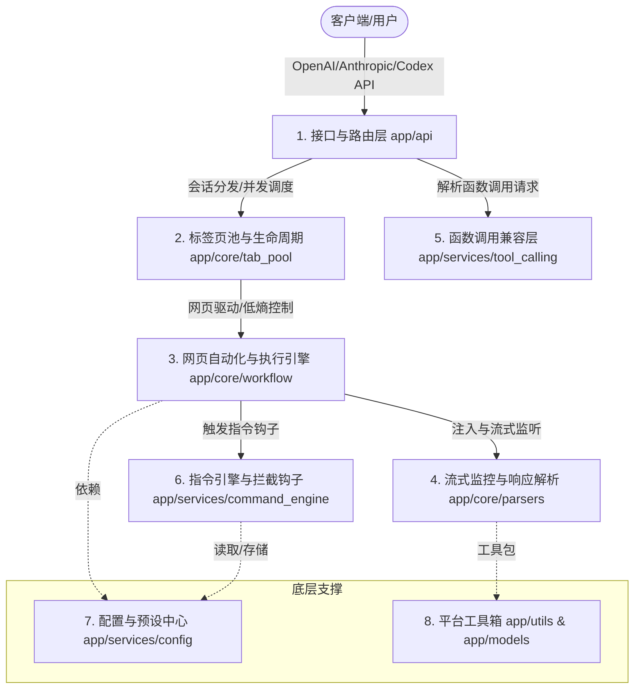

<p align="center">
  
</p>

# Universal Web API

📖 文档 • [English](./README.en.md) • [简体中文](./README.md)

当前版本：**2.9.8**（以 [`VERSION`](./VERSION) 和 [`CHANGELOG_CURRENT.md`](./CHANGELOG_CURRENT.md) 为准）

**Universal Web API** 是一个专为开发者设计的**本地 API 桥接调试工具**。它能够将您在本地浏览器中已登录并正常使用的 AI 网页端服务（如 ChatGPT, DeepSeek, Claude, Gemini 等）转换为本地标准的 OpenAI/Anthropic 兼容接口。

该项目致力于帮助个人开发者在本地进行**工作流编排、客户端集成测试与个人办公自动化**，无需将 API 密钥暴露给第三方，确保数据隐私与网络安全。

> ⚠️ **合规与安全申明**：本工具仅作为一个本地自动化辅助桥接器，在用户本地系统运行。它**不具备且不提供**任何绕过目标网站身份验证（登录）、破解安全机制（如人机验证）或逆向解密接口的功能。用户需自行在受控浏览器中登录合法账号。请勿将本工具用于高频自动化请求或任何商业用途。

---

## 📐 项目架构设计 (Mermaid 拓扑)



---

## 🌟 项目亮点

*   **⚡ 零配置、标准兼容**：提供标准 OpenAI 兼容（包括 `/v1/chat/completions` 与 `/v1/models`），并提供面向 Claude Code/Codex 等第三方编程工具的实验性兼容接入（如针对 Claude Code 的 `/v1/messages` 连通性测试，以及针对 Codex 插件的 `/v1/responses` 专用端点）。
*   **🛠️ 本地受控浏览器驱动**：基于 DrissionPage 库对本地 Chromium 内核浏览器（Chrome / Edge 等）进行轻量自动化控制，数据完全留存在本地，端到端隐私安全。
*   **🛡️ 拟人化安全调试**：内置平滑按键模拟、焦点仿真以及人鼠交互模拟，尽量降低因异常自动化检测导致的账号干扰。
*   **📦 智能标签页池调度**：内置标签页池（Tab Pool），支持默认分配、站点域名、固定标签页、精确 URL 与 URL 绑定预设路由，并提供优先空闲、轮询、随机等分配模式。
*   **📡 双通道流式解析**：结合网络层响应侦听（CDP Interception）与 DOM 增量分析双通道技术，无论网页端采用何种渲染方式，都能秒级同步输出 SSE 流式内容。
*   **📎 多模态与超长附件自愈**：
    *   自动提取并本地下载网页端的文字、图片、音频、视频内容。
    *   针对超长提示词，支持自动封装为本地临时文件进行上传（适合更偏好附件交互的网站）。
*   **🧩 智能函数调用自愈 (Tool Calling)**：在网页交互中注入参数校验反馈机制，如果模型输出的 JSON 参数校验失败，可自动发起本地回盘自愈，提高函数调用成功率。

---

## 🚀 快速开始

### 前提条件
1. 操作系统：Windows (完美支持) / macOS 或 Linux (支持基本功能)
2. 环境要求：**Python 3.10+** 且系统已安装 Chrome / Edge / Brave 等 Chromium 内核浏览器

### 安装启动步骤

1. **下载解压**：从 [Releases](https://github.com/lumingya/universal-web-api/releases) 下载最新压缩包，并解压到**无中文路径**的本地目录。
2. **一键启动**：
   * **Windows**：双击运行根目录下的 **`start.bat`**。
   * **macOS / Linux**：在终端执行 **`python3 start.py`**。
3. **完成初始化**：等待依赖包自动校验安装完成后，系统会自动弹出一个受控的浏览器窗口，并在普通浏览器中打开本地控制台 `http://127.0.0.1:8199`。受控浏览器只建议放 AI 站点，控制台和教程请在普通浏览器里查看。
4. **账号登录**：在受控浏览器窗口中，登录您拥有的 AI 网站账号（如 ChatGPT、DeepSeek 等），并保持目标站点停留在可对话页面。
5. **客户端配置**：在您的任意 AI 客户端（如翻译插件、Chat UI）中修改 API 配置：
   * **API 地址 (Base URL)**：`http://127.0.0.1:8199/v1`
   * **API Key**：若未启用服务 API 认证（`AUTH_ENABLED=false`），可填任意值（如 `sk-local`）；若已启用，请填写 `.env` 中的 `AUTH_TOKEN`。控制面板访问密钥是单独的 `DASHBOARD_AUTH_TOKEN`，不要提供给 API 使用者。

---

## 🎯 已适配站点列表

系统已内置多款主流 AI 站点的自动化交互规则。对于未收录的网站，控制台还支持通过 AI 自动分析网页 DOM 结构进行适配，详情请参阅 [新增站点指南](./static/tutorial/index.html#addsite)。

| 站点名称 | 官方网址 | 备注 |
| :--- | :--- | :--- |
| **ChatGPT** | chatgpt.com | 单次发送支持超长上下文 |
| **DeepSeek** | chat.deepseek.com | 已适配其深度思考 (Thinking) 流式提取 |
| **Gemini** | gemini.google.com | 适合本地多模态数据交互测试 |
| **Claude** | claude.ai | 支持完备的页面交互与附件上传 |
| **Kimi** | www.kimi.com | 支持长上下文附件粘贴模式 |
| **通义千问** | chat.qwen.ai | 国产大模型网页自动化测试 |
| **Grok** | grok.com | 支持网页原生交互流解析 |
| **豆包** | www.doubao.com | 完美适配最新版页面结构 |
| **AI Studio** | aistudio.google.com | 适合开发者高吞吐测试 |
| **Arena AI** | arena.ai | 用于盲测对比调试（对网络 IP 纯净度要求较高） |

---

## 📖 开发者文档

为了让您能够更好地自定义工作流与路由，我们准备了详细的本地 HTML 文档（可在服务启动后通过控制台访问）：

| 文档章节 | 描述说明 |
| :--- | :--- |
| 📖 [完整使用文档](./static/tutorial/index.html#quickstart) | 包含详细的安装说明、运行机制与各操作系统支持度 |
| 🔗 [连接 API 指南](./static/tutorial/index.html#connect) | 请求路由规则解释（默认、域名、固定标签页、精确 URL、URL 绑定预设）与调用代码示例 |
| 🧩 [智能函数调用](./static/tutorial/index.html#toolcalling) | 本地 Function Calling 的多轮纠错与自愈策略说明 |
| 🔄 [标签页池与预设](./static/tutorial/index.html#tabpool) | 如何配置多标签并发、路由方式、分配模式与预设（Presets） |
| 📊 [请求监控与排障](./static/tutorial/index.html#dashboard) | 查看请求历史、失败详情、分站点成功率，并使用调试接口取消或释放卡住的任务 |
| 🧾 [API 端点速查](./static/tutorial/index.html#api-reference) | 健康检查、模型、Provider 能力、OpenAI/Responses/Anthropic 端点与认证头 |
| 🛠️ [核心选择器与配置](./static/tutorial/index.html#selectors) | CSS 选择器编写、可视化步骤定义、流式参数解释 |
| 🛡️ [低干扰与高级环境](./static/tutorial/index.html#stealth) | 浏览器指纹防护、低熵行为模拟等抗检测配置 |
| ❓ [常见问题与限制说明](./static/tutorial/index.html#faq) | 超时排查、验证码处理指导、平台差异性说明 |
| 🔐 [安全边界与部署建议](./static/tutorial/index.html#security-boundary) | 本机监听、认证、CORS、DevTools 端口及敏感数据处理 |

---

## 🤝 交流反馈

* 遇到启动或适配问题，欢迎加 QQ 交流群 **1073037753** 寻求帮助。
* 也可以在项目 [Issues](https://github.com/lumingya/universal-web-api/issues) 提交反馈或特性建议。

---

## ⚖️ 免责声明 (Disclaimer)

1. **用途限制**：本项目仅限个人用于技术研究、学术探讨、开发调试及日常办公提效。请勿将其用于生产环境或任何商业牟利活动。
2. **合规使用**：使用本软件前，请务必仔细阅读并遵守各目标 AI 网站的《服务条款》和《使用协议》。使用者因使用本软件违反服务协议而产生的账号受限、封禁或其它争议，均由使用者本人承担。
3. **技术定位**：本软件不涉及任何针对目标网站的网络入侵、破解安全屏障、API 逆向工程或绕过付费限制的行为。所有功能均基于合法的本地浏览器自动化（即模拟用户屏幕操作），且完全开源可查。
4. **免责保证**：项目维护者不对因使用本软件造成的任何直接或间接损失（包括但不限于账号损失、商业利润损失或数据丢失）承担任何责任。

---

## 📄 开源许可证

本项目基于 [AGPL-3.0](./LICENSE) 协议开源。

---

## 详细速查：安装、API 与配置

### 环境与启动

- Python 3.10+，以及 Chrome、Edge 或 Brave 等 Chromium 浏览器。Windows 支持最完整；macOS/Linux 的文件剪贴板和窗口控制能力可能受系统限制。
- 推荐从 [Releases](https://github.com/lumingya/universal-web-api/releases) 解压到英文、无空格路径，并使用项目独立的 `chrome_profile`，不要复用日常浏览器配置。
- Windows 双击 `start.bat`；macOS/Linux 执行 `python3 start.py`。启动脚本会检查依赖、启动受控浏览器并打开 `http://127.0.0.1:8199/` 控制面板。
- 也可从源码执行：`python -m venv venv`、`python -m pip install -r requirements.txt`、`python start.py`。

受控浏览器用于登录 AI 站点；控制面板和教程请在普通浏览器打开。登录后让目标站点停留在可输入消息的对话页，再在客户端使用 Base URL `http://127.0.0.1:8199/v1`。模型名以 `GET /v1/models` 返回值为准。

### API 端点

| 方法 | 路径 | 说明 |
| --- | --- | --- |
| POST | `/v1/chat/completions` | OpenAI Chat Completions，支持 SSE 流式、工具调用和多模态输入 |
| POST | `/v1/responses` | OpenAI Responses 兼容入口（实验性） |
| POST | `/v1/messages` | Anthropic Messages 兼容入口；支持 `Authorization`、`x-api-key` |
| POST | `/v1/messages/count_tokens` | Anthropic 最小 token 估算接口 |
| GET | `/v1/models` | 当前标签页/预设暴露的模型目录 |
| GET | `/health` | 服务健康检查 |
| GET | `/v1/provider/capabilities` | 协议与功能能力清单 |
| GET | `/v1/provider/status` | 浏览器连接、标签页池和请求状态（不含密钥） |

最小请求示例：

```bash
curl http://127.0.0.1:8199/v1/chat/completions \
  -H "Content-Type: application/json" \
  -d '{"model":"YOUR_MODEL_ID","messages":[{"role":"user","content":"你好"}],"stream":false}'
```

启用认证后，增加 `-H "Authorization: Bearer YOUR_TOKEN"` 或 `-H "X-API-Key: YOUR_TOKEN"`。按站点或标签页固定路由时，可使用 `/url/{domain}/v1/chat/completions`、`/tab/{index}/v1/chat/completions`、`/tab-url/{token}/v1/chat/completions` 和 `/group/{id}/v1/chat/completions`；预设可通过路径或请求体 `preset_name` 指定。

### `.env` 关键项

复制 `.env.example` 为 `.env`。修改环境变量后重启服务；站点 JSON 可在控制面板中编辑，修改前建议先备份。

| 变量 | 建议值/说明 |
| --- | --- |
| `APP_HOST` / `APP_PORT` | 默认 `127.0.0.1` / `8199`。仅在配置防火墙和认证后才考虑 `0.0.0.0`。 |
| `APP_DEBUG` | 默认关闭；开启会暴露 `/docs`、`/redoc` 和详细错误。 |
| `AUTH_ENABLED` + `AUTH_TOKEN` | API Bearer / `X-API-Key` 认证，启用时令牌必须非空且足够随机。 |
| `DASHBOARD_AUTH_ENABLED` + `DASHBOARD_AUTH_TOKEN` | 控制面板和管理接口认证，可与 API 使用不同令牌。 |
| `CORS_ENABLED` / `CORS_ORIGINS` | 本机默认关闭；确需跨域时再打开，并填写明确来源列表，不要长期使用 `*`。 |
| `BROWSER_PORT` | 默认 `9222`，仅允许回环访问且不能与其他 Chrome 冲突。 |
| `BROWSER_PROFILE_DIR` / `BROWSER_PROFILE_NAME` | 指向独立 User Data 根目录和子配置名；Chrome 136+ 不要直接复用系统默认 User Data。 |
| `SITES_CONFIG_FILE` | 默认 `config/sites.json`，保存站点规则、工作流和预设。 |
| `PROXY_ENABLED` / `PROXY_ADDRESS` | 按需配置 HTTP 或 SOCKS5 代理。 |

### 故障排查

1. 控制面板打不开：确认 `start.py` 仍在运行，检查端口占用并访问 `/health`。
2. 没有可用标签页：确认受控浏览器已启动、已登录且停留在目标站点；查看 `/v1/provider/status` 的 `browser.connected`、`pool.idle`。
3. 429 或排队超时：标签页均忙或 `acquire_timeout` 太短，降低并发、增加标签页或调整分配模式。
4. 页面有回复但 API 首包超时：先看请求监控，再测试选择器；网络监听会按配置回退到 DOM 解析。
5. 回复为空/立即 DONE：更新浏览器，确认不是登录、验证码或错误页，并避免复用系统 Profile。
6. 附件或媒体失败：检查文件大小、后缀及 `temp`、`download_images` 权限；音频转码需要 `ffmpeg`。
7. 浏览器无法接管：关闭占用 `BROWSER_PORT` 的 Chrome，或改用其他端口和独立 Profile。

提交 Issue 时请附操作系统、Python/浏览器版本、请求路径、脱敏日志和 `/v1/provider/status` 结果；不要上传 Cookie、完整 Profile、API 密钥或聊天原文。

### 安全边界

本项目面向单机调试，不提供多租户隔离、计费、审计或高可用保障。`APP_HOST=0.0.0.0` 会暴露 API 和管理接口，必须同时启用强认证、限制 CORS、配置防火墙并使用 TLS 反向代理。DevTools `9222` 端口能够控制整个浏览器，严禁公网暴露。日志、临时附件、媒体文件和 `chrome_profile` 可能含敏感数据，请限制权限并定期清理。代理、辅助 AI、自动更新和命令引擎只应连接你信任的地址和脚本。
