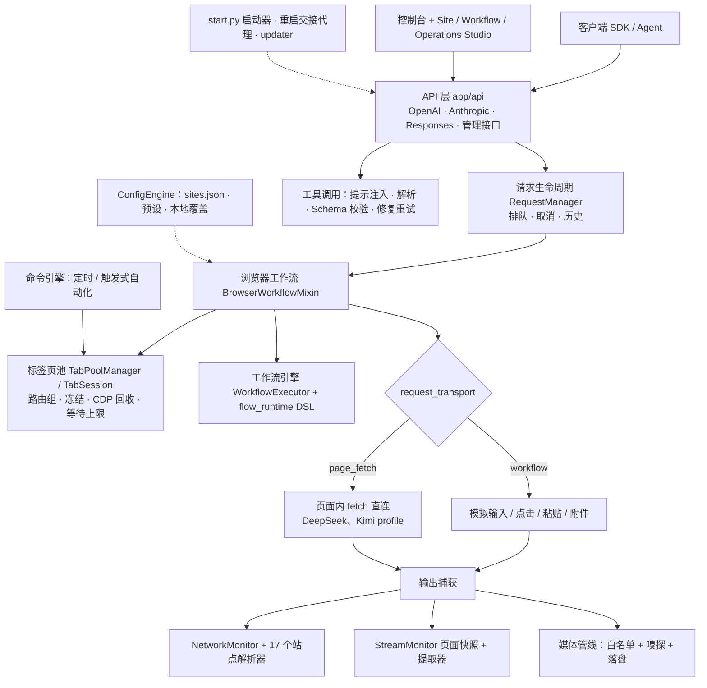

# universal-web-api 项目分析与后续开发方向（2026-09）

> 分析日期：2026-09-26 · 基准：`main@6209bdf`（已合并 P1+P2 安全修复）· `VERSION=3.0.0`（最新 Release 为 2.10.0）
>
> 范围：架构梳理、工程现状体检、用户反馈与竞品对照、战略定位与路线图。**本轮只做分析，未修改任何业务代码。**
>
> 验证口径：沙盒内轻量检查（pytest 纯逻辑子集、compileall、ruff 语法/未定义名、`node --check`），
> 以及对 `fix/review-p1-p2-b` 分支的**无提交试合并**。未安装 Playwright/Chromium，未运行浏览器 E2E，未截图，未压测。
> 站点可用性相关结论均为静态推断。

---

## 0. 一页结论

**定位**：本机运行的"已登录 AI 网页 → OpenAI / Anthropic 兼容 API"桥接工具。实际上它已经长成了一个面向 AI 网页的
**可配置浏览器自动化平台**：工作流 DSL、命令引擎、标签页池、路由组，外加 Site / Workflow / Operations 三个可视化 Studio。

**成熟度判断**：功能面在同类项目中领先（12 个站点、3 套协议、网络+DOM 双通道抓取、可视化适配），
但**工程化明显落后于功能**：没有 CI、Release 靠手工打包、测试资产没有全部入库、巨型类多、行尾混乱导致社区 PR 基本无法合并。

**当前最该做的 6 件事**（详见 §6 阶段 0）：

1. **合并 `fix/review-p1-p2-b`**：P3 的 16/17 项已在该分支完成（18 个提交），尚未进入 main。试合并只有 1 处文档冲突，合并后 **691 passed / 63 skipped / 0 failed**。
2. **发布阻断项**：`start.py:1490` 用了只有 **Python ≥ 3.12** 才能解析的 f-string 写法，而 README 声明支持 3.10+。
   `start.bat` 检测到 PATH 里有 `python` 就直接执行 `python start.py`，不检查版本。结果是默认 Python 为 3.10/3.11 的用户
   （Windows、Ubuntu 22.04、Debian 12 等）一启动就报 SyntaxError。该行 2026-09-24 引入，**还没进入任何 Release，必须在 3.0.0 发布前修掉**（P3 分支也还没修）。
3. **CI + 自动化发包**：避免 #25（2.9.8 发布包漏了 `static/js/`，面板一直卡在"加载中"）这类事故再次发生；同时统一版本号，清理误打的 `3.7.5` 标签。
4. **测试资产入库**：`tests/` 在 `.gitignore` 里默认忽略、只放行白名单，导致 CHANGELOG-3.0.0 列出的约 10 个测试文件（`test_stream_snapshot.py`、`test_cdp_hygiene.py`、`test_idle_maintenance.py`……）**从未提交过**。
5. **统一行尾**：41 个文件在同一文件内混用 CRLF 和 LF，统一后才能重新打开社区贡献通道。
6. **把"站点适配器"当作独立产品线来做**：Schema、版本、独立热更新通道、金标测试、健康巡检。这是本项目相对竞品真正的护城河，也是用户痛点最集中的地方（#20、#24）。

**不建议投入**：继续扩大验证码/Turnstile 自动通过、指纹伪装、代理轮换这类规避能力（原因见 §3.5、§6.5）。

---

## 1. 项目画像

| 维度 | 数据 |
| --- | --- |
| 仓库 | `lumingya/universal-web-api`，AGPL-3.0，公开；446★ / 101 forks |
| 历史 | 2025-12-17 创建；main 262 个提交（所有分支合计 280），基本由维护者一人完成；2026-09 单月 67 个提交 |
| 发布 | 共 66 个 Release（从 0.1 到 2.10.0），近 6 个月 30 个，约每周一版；资产累计下载约 2.1k 次 |
| 规模 | `app/`：171 个 Python 文件，约 10.9 万行；测试约 1.6 万行；前端 JS 约 3.3 万行（无构建），CSS 约 1.1 万行；`config/sites.json` 7311 行 / 271KB |
| 技术栈 | FastAPI 0.109 + Uvicorn + Pydantic v2；DrissionPage 4.1（通过 CDP 驱动有头 Chromium）；Vue 3 全局构建 + 浏览器端 Tailwind Play CDN；数据用 JSON 文件持久化 |
| 协议 | OpenAI：Chat Completions、Responses（实验）、Models；Anthropic：Messages、count_tokens；共 149 个 HTTP 路由 |
| 站点 | ChatGPT、DeepSeek、Gemini、Claude、Kimi、Qwen、Grok、豆包、AI Studio、Arena、GLM、MiMo（12 个，另有 `_global`） |
| 平台 | Windows 支持最完整；macOS/Linux 可用核心功能；目前只支持单浏览器实例、单 Profile |

---

## 2. 架构解析

### 2.1 分层



### 2.2 一次 `/v1/chat/completions` 请求的路径

1. `chat.py` 校验请求并解析路由（域名 / 预设 / 标签页 / 精确 URL / 路由组），把工具定义转成提示词。
2. `RequestManager` 创建上下文并排队；`TabPoolManager.acquire*` 分配会话。等待队列有总量上限，满了返回 503（可重试）。
3. `BrowserWorkflowMixin` 读取预设，`_build_prompt_from_messages` 把**全部 messages 扁平化为 `role: text` 文本**，超长时改用文件粘贴，然后按工作流 DSL 执行（新建对话 → 填充 → 发送 → `STREAM_WAIT`）。
   默认每次都新建网页对话；开启时间阈值复用会话后，仍然会**重复发送完整历史**。
4. 输出捕获：优先走网络监听加站点解析器，不满足条件时回退到 DOM 快照；媒体经过白名单和内容嗅探后落盘。
5. `sse_formatter` 按协议组装 SSE 或 JSON。工具调用从文本中解析出来，经 Schema 校验，必要时修复重试。

### 2.3 子系统体量

| 子系统 | 约行数 | 代表文件 |
| --- | --- | --- |
| 工作流引擎 | 13.9K | `workflow/executor*`、`text_input.py`(2122)、`attachment_monitor.py` |
| API 层 | ~16K | `tab_routes.py`(5142)、`chat.py`(3326)、`config_routes.py`、`system.py` |
| 命令引擎 | 9.2K | `command_engine.py`(3870，132 个方法)、`command_engine_actions.py`(3166) |
| 媒体 | 8.4K | `browser/media.py`(3226)、`extractors/media_extractor.py`(3253) |
| 解析器 | 7.1K | 17 个 `*_parser.py` |
| 标签页池 | ~6K | `tab_pool_parts/manager.py`(4567，136 个方法)、`session.py` |
| 工具调用 | 3.4K | `tool_calling_parse.py`、`tool_calling_validation_retry.py` |
| Arena 专项 | 20 个文件，10.3K | `arena_*` 服务、5 个 lmarena 解析器 |

### 2.4 核心资产判断

- **真正的护城河**是"配置驱动的站点适配器"（选择器 + 工作流 DSL + 流配置 + 解析器）以及围绕它的可视化工具链。协议层和标签页池是通用能力，竞品也有。
- **最大的不稳定来源**同样是适配器：站点前端改版（哈希类名，例如 DeepSeek 预设里的 `div._5a8ac7a`、`._7436101.bcc55ca1`）或者接口格式变化（#20、#24）。
- Arena 专项代码约占十分之一，而且集中了规避类能力，和"通用"的定位有偏离。

---

## 3. 工程现状体检

### 3.1 做得好的地方

- 协议覆盖广：OpenAI、Anthropic、Responses 三套，六种路由写法；同时接受 `Authorization` 和 `x-api-key`。
- 网络和 DOM 双通道抓取，带自动回退；`page_fetch` 传输模式为后续"少模拟、多直连"打下了基础。
- 3.0.0 的性能重构有量化数据：每次轮询的 CDP 命令从约 138 条降到 1 条，已移除 DOM 残留从 6007 个降到 7 个，LMArena 解析快约 125 倍。所有改动都带回退开关，这个做法值得延续。
- 2026-09 完成安全加固：P1(6)、P2(15) 全部修复，约 118 项回归测试；认证和 CORS 改为 fail-closed，媒体走白名单，SSRF 加了 DNS pinning，交接代理可以防请求走私。
- 自动更新做了 SHA-256 校验、ZIP 路径/体积/压缩比限制，失败可回滚。
- Studio 和教程完善，非开发者也能上手。

### 3.2 分支与合并状态（重要）

| 分支 | 内容 | 状态 |
| --- | --- | --- |
| `main@6209bdf` | P1+P2 修复，并融合了 S2/S4/S6 | 线上 |
| `origin/fix/review-p1-p2-b` | 基于 `c562a48` 另开的 **18 个提交**：P3 16/17 项（B4、B6、B7、S7、S14、H2、H3、H5、H6 计划、H7、H8、H10、H11、H13、H14、T2）以及 `test_review_fixes_p3.py` | **未合并**；只有 H4（行尾）等待决定 |

无提交试合并（`git merge --no-commit`）的结果：

- 只有 `docs/review/DEVLOG-fixes-2026-09.md` 一处冲突，`main.py` 自动合并。
- 合并后的测试：**691 passed / 63 skipped / 0 failed**（main 是 652 / 63）。
- 合并后 ruff（py310）剩下 `start.py` 的 f-string 语法问题（P3 未覆盖），以及测试文件里一处 `BaseExceptionGroup`（3.11+）。

### 3.3 本次新发现或复核的问题

| # | 级别 | 问题 | 证据 |
| --- | --- | --- | --- |
| N1 | **高（发布阻断）** | `start.py:1490` 在 f-string 内复用外层引号（PEP 701），只有 3.12+ 能解析。README 写 3.10+，`start.bat` 回退路径和 `start.py` 自检只要求 ≥3.8，`start.bat` 首选路径根本不检查版本 | `ruff --target-version py310` 报 invalid-syntax；`git blame` 指向 `270e814`（2026-09-24），不在 2.10.0 中 |
| N2 | 高 | 没有任何 CI（Actions 工作流数为 0），Release 手工打包：#25（漏 `static/js/`）、#9（Release 与 git 不同步）；资产命名多次变化 | GitHub API |
| N3 | 高 | `tests/` 采用白名单入库，v3.0.0 的约 10 个测试文件和 `_real_browser.py`、两个 e2e 脚本从未提交。CHANGELOG 写"900 项通过"，main 实际可收集 715 项（合并 P3 后 754 项） | `git log --all -- tests/<name>` 为空 |
| N4 | 中 | 存在误打的 `3.7.5` 标签（指向 2026-04-02 的市场投稿提交），按语义版本比 3.0.0 还"新"，会误导按标签取版本的工具和后续自动发包 | `git tag` |
| N5 | 中 | 行尾：41 个文件同一文件内混用 CRLF/LF，39 个纯 CRLF，没有 `.gitattributes`。社区 PR #16/#17/#18（+3.8K 到 +7.3K 行）和 #21（+1679/-859）因噪音 diff 未合并，维护者只能手工吸收思路；只有 +38 行的 #26 被合并 | 统计脚本 |
| N6 | 中 | 主流解析器（chatgpt、claude、deepseek、gemini、kimi、qwen、aistudio、glm）在测试里**零引用**；没有 `/v1/messages`、Responses 的协议一致性测试 | grep |
| N7 | 中 | 测试入口不唯一：`python -m unittest discover` 绕过 `conftest.py`，出现 6 个失败、20 个错误；部分 browser 模块在顶层 `import playwright`，裸跑 `pytest tests` 在收集阶段就失败；没有 `pyproject.toml` 和 pytest 配置 | 实测 |
| N8 | 中 | DrissionPage 的许可证是"仅限学习和合法非盈利目的，商用需授权，不得用于可能有损他人利益的项目，遵守 Robots 协议，违反即失效"，与 AGPL-3.0 赋予的自由有冲突。另外 `patch_drissionpage.py`（972 行）会直接改写 site-packages 里的源码，而依赖范围 `<5.0.0` 太宽：4.2.0 已发到 b20，5.0.0 也进入了 beta。4.2.0 正式版一发布就会被自动安装，字符串补丁随时可能失配 | 许可证原文、补丁脚本、PyPI |
| N9 | 中 | 配置蔓延：代码直接读取约 126 个环境变量（153 处 `os.getenv`），其中约 69 个不在 `.env.example` 里；前端 `dashboard-schema.js` 又维护了一份默认值 | 粗略统计 |
| N10 | 中 | 依赖陈旧：FastAPI 0.109.2（最新 0.141.1）、Starlette 0.36.3（最新 1.7.0）、Uvicorn <0.30（最新 0.54.0），没有锁文件。P3 分支已有升级计划和新版试跑结果（`docs/review/DEPENDENCY_UPGRADE_PLAN.md`） | PyPI |
| N11 | 低 | 巨型类：TabPoolManager 136 个方法、CommandEngine 132、ConfigEngine 93、RequestManager 90、NetworkMonitor 88；另有 1454 处 `except Exception` 和 164 处 `time.sleep` 轮询 | AST 统计 |
| N12 | 低 | 残留：`app/core/browser.py` 被同名包遮蔽，从不生效；插件市场代码 2026-07 已删除，但 `upload_url` 还指向不存在的 issue 模板；性能文档引用的 `refactor_report.md`（Layer 1–3 规划）不在仓库中 | — |
| N13 | 低 | 前端在浏览器里运行 Tailwind Play CDN（407KB JIT 编译器，控制台会提示不要用于生产），没有构建和模块化；`?v=` 缓存戳混乱，路径混用相对和绝对写法 | `static/index.html` |
| N14 | 低 | 提交信息：main 的 262 个提交中有 153 个标题只写了"更新"，不利于追溯和自动生成 CHANGELOG | git log |

### 3.4 P3 状态

合并 `fix/review-p1-p2-b` 后，P3 只剩 **H4 行尾统一**。建议的执行方式：先合并 P3 分支，再**单独做一次**
`.gitattributes` + `git add --renormalize .` 的提交，提交信息写清楚"仅行尾"，并在 `.git-blame-ignore-revs` 里登记这次提交，避免污染 blame。

### 3.5 合规与供应链风险

- **规避类能力**：`cf_turnstile_solver.py`（Turnstile / 5 秒盾自动点击）、`human_mouse.py`（拟人鼠标轨迹）、`arena_proxy_rotation.py`（Clash 节点轮换）、预设里的 `stealth` 和 `prompt_padding`（随机填充）。
  这类能力最容易违反目标站点条款，也有被代码托管平台处理的风险，而且和 README "这不是绕过验证码或访问控制"的说法相矛盾。
- **自动更新的信任根**：updater 校验的是 GitHub 记录的资产摘要，能发现传输损坏，但**防不住仓库或令牌被盗后上传的恶意 Release**。所有开了自动更新的用户，其安全都取决于仓库凭据的安全。
- **协作令牌**：AI 或自动化协作时应使用只授权本仓库 `contents:write`、有效期短的细粒度令牌，用完即撤销；main 应配置规则集（禁止强推，要求 CI 通过）。

---

## 4. 用户反馈与竞品对照

### 4.1 Issue / PR 信号（21 个 Issue、5 个 PR，全部已关闭）

| 类别 | 代表 | 含义 |
| --- | --- | --- |
| 站点适配失效 | #20 DeepSeek 搜索时回复为空；#24 Grok 流式抓取失败 | 修复要等下个 Release，或让用户手改 JSON，**时效差** |
| 发布质量 | #25 发布包漏 `static/js`；#9 Release 与 git 不同步 | 需要 CI 和清单校验 |
| 部署 | #22 请求 Docker（同类项目基本都有） | 关闭时没有回复，需求仍在 |
| Agent 场景 | #3 CrewAI 长提示词超时（16 条评论）；#7 工具调用 | 长上下文、首包等待、工具调用的可靠性 |
| 生态 | 9 个"[市场投稿]"issue（含 3 个测试） | 用户有分享预设的意愿，但市场功能已下线 |
| 贡献 | 5 个外部 PR 只合并了 1 个 | 行尾噪音和巨型文件抬高了合并成本 |

### 4.2 同类项目对照（信息来自各自 README）

| 能力 | 本项目 | [WebAI-to-API](https://github.com/Amm1rr/WebAI-to-API) | [AIstudioProxyAPI](https://github.com/CJackHwang/AIstudioProxyAPI) | [Chat2API-web](https://github.com/LeeSpo/Chat2API-web) | [ai-web2api](https://github.com/yaohuiwu/ai-web2api) |
| --- | --- | --- | --- | --- | --- |
| 接入方式 | DOM 自动化 + 页面内 fetch | WebAPI / Playwright | Playwright + Camoufox | 网页账号凭据直连 | Playwright DOM 自动化 |
| 多站点通用配置 | ✅ 12 站，可视化新增 | 以 Gemini 为主 | 仅 AI Studio | 多站点（内置 provider） | 3 站，YAML 选择器 |
| 可视化工作流/选择器编辑 | ✅ **独有** | — | — | — | DOM 调试接口 |
| Anthropic / Responses | ✅ / 实验 | — | — | Responses ✅ | — |
| 工具调用 | 模拟 + Schema 修复重试 | — | auto / native / emulated 三模式带回退 | ✅ | 提示注入 |
| Docker / 无显示器部署 | ❌ | ✅ | — | ✅ | MJPEG 实时画面 + 登录态导入 |
| 多账号 / 多 Profile 路由 | ❌ | — | Profile 轮换 | 轮询 / 填满 / 故障转移 | 多 context |
| 长任务控制 | 取消 / 超时 / 等待上限 | 就绪端点 | — | 上下文压缩、keep-alive、准入队列 | — |

### 4.3 结论

- **差异化优势**：通用性，加上可视化适配工具链，加上双通道抓取。
- **短板**：部署形态（Docker、远程登录画面）、多账号池、适配器的分发与自愈、工程可信度（CI、测试、发布）。

---

## 5. 战略定位与北极星

### 5.1 三条可选路线

| 路线 | 内容 | 评价 |
| --- | --- | --- |
| A. 本机 AI 网页网关 | 深耕现有能力：协议兼容、稳定性、Agent 体验 | **主干**，用户基础在这里 |
| B. AI 网页自动化平台 | 把工作流和命令开放成可编程接口，接入 MCP | 以较低成本延伸，复用现有工作流引擎 |
| C. 适配器生态 | 社区贡献站点适配器，建注册表、签名分发 | **增长引擎**，同时把维护压力分摊给社区 |

**建议**：以 A 为主干，C 作为增长引擎，B 通过 MCP 适度延伸。

### 5.2 北极星指标

1. **适配器 MTTR**：从站点改版导致失效，到修复送达用户的中位时长。目标 < 24 小时，依赖 §6.2 的独立更新通道。
2. **Agent 场景一次成功率**：长提示词加工具调用的请求，无需重试就成功的比例。

---

## 6. 路线图

**指导原则**：① 先保证可交付，再加新功能；② 适配器就是数据，也是产品；③ 用契约测试做护栏，保证无浏览器也能在 CI 跑；
④ 渐进式重构，接口先行，每一步都能用开关回退（延续 3.0.0 的做法）；⑤ 不扩大规避能力。

### 6.1 阶段 0：止血与发布工程（1–2 周）

| ID | 事项 | 验收标准 |
| --- | --- | --- |
| R0-1 | 合并 `fix/review-p1-p2-b`（解决 DEVLOG 冲突），然后删除该分支 | main 测试 ≥ 691 通过、0 失败 |
| R0-2 | 修复 N1：改写 `start.py:1490`；四处最低版本统一为 3.10（start.bat 快速路径加版本检查、start.py 自检、README、requirements 注释） | `ruff --target-version py310` 没有 invalid-syntax；CI 覆盖 3.10–3.13 |
| R0-3 | GitHub Actions：ruff（E9/F821/F811）+ compileall + `node --check` + `pytest -m "not local_fixture"`，Windows、Ubuntu × Python 3.10 / 3.12 / 3.13 | PR 必须通过 CI 才能合并 |
| R0-4 | 自动发包：打标签后用 `git archive` 生成 zip → 清单校验（`static/js` 存在、VERSION 与标签一致、不含 `chrome_profile` 和 `.env`）→ 上传 → 生成构建证明（artifact attestation）；删除或更名 `3.7.5` 标签 | #25、#9 类问题不再出现 |
| R0-5 | 测试入库：`.gitignore` 从白名单改为黑名单，补交 v3.0.0 的测试；新增 `pyproject.toml`（pytest markers：`browser` / `real_browser` / `local_fixture`，默认排除浏览器测试）；browser 模块改用 `pytest.importorskip("playwright")` | 直接运行 `python -m pytest` 即可 |
| R0-6 | H4 行尾统一（单独提交，并登记到 `.git-blame-ignore-revs`） | 混用行尾的文件数为 0 |
| R0-7 | 发布 3.0.0，附迁移说明和回退开关表；此后 README 的版本号由脚本或测试保证与 VERSION 一致（P3 已加测试） | Release 与 main 一致 |
| R0-8 | 仓库安全：细粒度最小权限令牌、main 规则集、维护者账号开启 2FA | — |

### 6.2 阶段 1：适配器工程化（1–2 个月），核心护城河

| ID | 事项 | 说明 |
| --- | --- | --- |
| R1-1 | 站点适配器 Schema v1 | 为 preset 的 selectors、workflow、stream_config、file_paste、image_extraction、request_transport 定义 JSON Schema 和 `schema_version`，保存、导入、CI 三处都做校验；迁移复用 `docs/migrations` 的机制 |
| R1-2 | 拆分 271KB 的 `sites.json` | 改为 `sites/<domain>.json`，每个站点独立带 `adapter_version`、`min_app_version`、`last_verified`，运行时合并。这样能减少冲突，审阅也更方便 |
| R1-3 | 适配器独立更新通道 | 不发整包就能热更新站点配置：发布带签名或摘要的适配器索引，客户端校验后合并，并保留本地覆盖。#24 这类修复可以从"等下个版本或手改 JSON"缩短到小时级。插件市场也可以在此基础上改用 PR 审核（而不是 issue 投稿）重新上线 |
| R1-4 | 解析器金标测试 | 为 17 个解析器录制脱敏后的网络流样本（SSE / NDJSON / JSON），断言正文、思考过程、图片和结束标志；新增站点必须附带样本 |
| R1-5 | 协议一致性测试 | 用官方 openai、anthropic Python SDK 作为客户端，对接"假浏览器后端"，覆盖流式和非流式、工具调用、usage、错误码、Anthropic 事件顺序、Responses 续接 |
| R1-6 | 适配器健康巡检 | 每个站点做低成本自检：页面可达、登录态、关键选择器能命中，全程不发消息；合成请求只在用户显式开启时执行。结果接入 `/v1/provider/status` 和面板，失败时直接提示"选择器失效 / 需要登录 / 被验证页拦截" |
| R1-7 | 选择器韧性 | 优先使用语义锚点（role、aria、占位文本、结构关系）代替哈希类名；支持候选列表和打分；Site Studio 根据 DOM 给出修复建议，**人工确认后才生效** |

### 6.3 阶段 2：架构演进，对应 Layer 1–3（2–4 个月）

| ID | 事项 | 说明 |
| --- | --- | --- |
| R2-1 | 浏览器驱动接口 `BrowserDriver` | 抽象 run_js、run_cdp、find、click、type、listen、screenshot。先用 DrissionPage 实现，再评估 Playwright `connect_over_cdp`（Apache-2.0）或自研的薄 CDP 客户端。把 `patch_drissionpage.py` 的监听增强收进项目自己的网络层，不再改写第三方源码，也解决许可证的不确定性（N8）。改造前先把 DrissionPage 版本锁死 |
| R2-2 | 统一内部请求模型 | OpenAI、Anthropic、Responses（以及以后的 MCP）都先翻译成同一个 ChatJob；`chat.py` 和 `anthropic_routes.py` 退化为薄的协议适配层 |
| R2-3 | 拆解巨型类 | TabPoolManager 拆成分配器、路由组、恢复、维护；CommandEngine 拆成存储、调度、触发器、动作插件；ConfigEngine 拆成仓储、校验、迁移；`tab_routes.py` 按资源拆分 |
| R2-4 | 类型化配置 | 以 pydantic-settings 作为单一事实源，自动生成 `.env.example`、面板 schema 和文档；启动时校验，并打印脱敏后的生效配置（解决 N9） |
| R2-5 | 持久化 | 请求历史、命令结果、统计改用 SQLite（WAL 模式）替代 JSON 文件，支持查询和保留策略 |
| R2-6 | 进程模型 | 可选把浏览器 worker 和 API 进程分开，通过队列通信：崩溃互相隔离，API 重启不中断，也能简化现有的交接代理 |
| R2-7 | 可观测性 | 提供 `/metrics`（Prometheus）、结构化日志，以及贯穿 API → 标签页池 → 工作流 → 解析器的请求 ID；收窄 `except Exception`，统一错误分类（延续 `error_metadata`） |
| R2-8 | 前端工程化 | 预编译 Tailwind CSS，去掉 407KB 的浏览器端编译器；改用 ES Modules；拆分 3315 行的 `dashboard-methods.js`；引入不依赖浏览器的 Node 端逻辑测试（jsdom） |

### 6.4 阶段 3：能力扩展（3–6 个月以上）

| ID | 方向 | 说明 |
| --- | --- | --- |
| R3-1 | 官方 Docker 镜像 | Chromium + Xvfb + noVNC 或实时画面用于登录；Profile 和 config 挂载为卷；提供 docker-compose，支持 amd64 和 arm64（回应 #22） |
| R3-2 | 多 Profile / 多账号池 | 支持多个浏览器实例或多个 Profile，路由策略包括轮询、填满、故障转移；每个账号单独设并发和冷却时间，**遵守各站点的使用限制** |
| R3-3 | 会话亲和与增量发送 | 用消息前缀哈希关联网页会话：如果客户端历史是上一次请求的前缀，就只发新增的轮次，否则回退到全量。这样长对话的粘贴量和首字延迟都会明显下降（对应 §2.2 第 3 点） |
| R3-4 | Agent 长上下文策略 | 按站点的上下文上限，自动在"直接输入 / 文件粘贴 / 压缩摘要"之间选择；首包等待期间发送 SSE keep-alive；为 Claude Code、Codex、CrewAI 给出超时配置建议（#3） |
| R3-5 | 工具调用 2.0 | 站点有原生能力时走 native，否则用 emulated 加 Schema 约束修复；支持流式 tool_call 增量；建一个小型评测集，按站点输出工具调用成功率 |
| R3-6 | MCP 服务端 | 按 MCP 2026-07-28 规范（Streamable HTTP）把"向某站点提问 / 执行某个工作流"暴露为工具，长任务用 Tasks 扩展，让 IDE 和 Agent 可以直接调用 |
| R3-7 | 插件 SDK | 解析器、提取器、传输以 entry-point 插件的形式发布，并声明自身能力；自定义代码默认在独立的低权限子进程中运行，取代进程内 AST 过滤 |
| R3-8 | 国际化 | 控制台提供英文界面，建立文档站点，扩大非中文用户群 |

### 6.5 明确不建议

- 扩大验证码 / Turnstile 自动通过、浏览器指纹伪装、为规避限流而做的 IP 轮换。现有相关模块建议默认关闭，拆成可选组件并写清责任边界，长期考虑移出默认发行包。
- 面向公网的多租户网关或计费转售。这和"单机调试工具"的安全模型、目标站点的条款都有冲突。
- 以"免费无限调用"作为卖点宣传。

---

## 7. 优先级矩阵

| 优先级 | 事项 | 价值 | 成本 |
| --- | --- | --- | --- |
| P0 | R0-2 修复 3.12 语法（发布阻断） | 高 | 极低 |
| P0 | R0-1 合并 P3 分支 | 高 | 低 |
| P0 | R0-3 / R0-4 CI + 自动发包 | 高 | 低 |
| P0 | R0-5 测试入库，统一测试入口 | 高 | 低 |
| P1 | R0-6 行尾统一 | 中高（解锁社区贡献） | 低 |
| P1 | R1-4 / R1-5 金标测试 + 协议契约测试 | 高 | 中 |
| P1 | R1-1 / R1-3 适配器 Schema + 热更新通道 | 很高 | 中 |
| P1 | R1-6 健康巡检 | 高 | 中 |
| P2 | R3-1 Docker | 高（用户呼声） | 中 |
| P2 | R2-1 驱动接口 | 高（长期） | 高 |
| P2 | R2-2 / R2-3 统一请求模型 + 拆类 | 中高 | 高 |
| P3 | R3-2 / R3-3 / R3-5 / R3-6 | 中高 | 中到高 |

---

## 8. 建议跟踪的指标

- **发布**：CI 通过率、Release 清单校验通过率、Release 落后 main 的提交数。
- **适配器**：失效到修复的中位时长（目标 < 24h）、健康巡检在线率、每站点每月选择器失效次数。
- **质量**：内置解析器金标覆盖率（目标 100%）、协议一致性用例通过率、`except Exception` 数量趋势、超过 2000 行的文件数。
- **性能**：首字延迟 P50 / P95、N 次请求后渲染进程内存、每个请求的 CDP 调用次数。
- **社区**：外部 PR 合并率、Issue 首次响应时长。

---

## 9. 附录

### 9.1 本次运行的检查（Python 3.13 虚拟环境，位于工作区之外）

```text
pytest（排除 10 个需要浏览器 / Playwright 的模块）
  main@6209bdf                          → 652 passed, 63 skipped, 0 failed（约 12s）
  main + fix/review-p1-p2-b（试合并）   → 691 passed, 63 skipped, 0 failed
python -m unittest discover -s tests    → Ran 60, failures=6, errors=20（绕过 conftest，不是有效入口）
python -m compileall app main.py start.py updater.py → OK
ruff --select E9,F821,F822,F823,F811 --target-version py310（main）
  → 16 项：start.py f-string 语法 2 项、F821 6 项（含 1 项测试）、F811 8 项
node --check static/js/**/*.js（33 个文件）→ 全部通过
git merge-tree --write-tree main origin/fix/review-p1-p2-b → 仅 DEVLOG 冲突
```

### 9.2 数据来源

- GitHub REST API：仓库元数据、Release、标签、Issue、PR、Actions 工作流。
- PyPI JSON API：依赖的最新版本。
- DrissionPage 许可证原文：已安装包的 `dist-info/licenses/LICENSE`。
- 同类项目：[WebAI-to-API](https://github.com/Amm1rr/WebAI-to-API)、[AIstudioProxyAPI](https://github.com/CJackHwang/AIstudioProxyAPI)、
  [Chat2API-web](https://github.com/LeeSpo/Chat2API-web)、[ai-web2api](https://github.com/yaohuiwu/ai-web2api)。
- MCP：[2026-07-28 规范说明](https://blog.cloudflare.com/mcp-v2/)、[版本时间线](https://hidekazu-konishi.com/entry/mcp_specification_version_timeline.html)、
  [官方 Python SDK](https://github.com/modelcontextprotocol/python-sdk)。

### 9.3 本轮没有做的事

- 没有安装 Playwright / Chromium，没有运行浏览器 E2E，没有截图，没有压测。
- 没有修改任何业务代码，也没有合并分支；试合并用的是临时 worktree，已删除。
- 本文不包含任何凭据。
